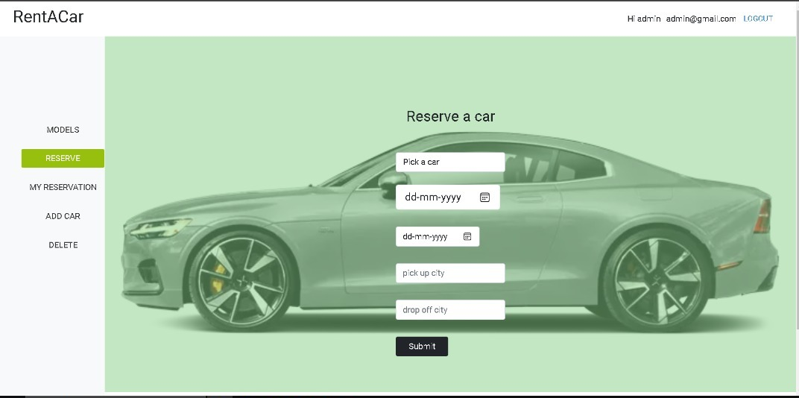

# Rent-a-car

## Description

In this project, we have designed a booking app where a user can rent a car. The app also presents Admin privileges where an Admin can Add and Delete cars. This is engineered using Ruby on Rails as backend and React as front end. In this repository we have the backend. The frontend can be found [here.](https://github.com/netman5/Rent-a-car-FE)

It is built as a requirement for the Microverse Final Capstone.

## Demo

[Coming soon!](https://livedemo.com/)

## Built With

- Rails
- Commandline
- PostgreSQL
- JWT Authentication
- Git & GitHub

### Prerequisites

Internet connection and basic computing skills.

1. git clone `https://github.com/brytebee/Rent-a-car.git`

## Getting started

1. Installing the packages by running `bundle install`
2. On the cmd run `rails server`

## Testing

1. Installing the packages by running `bundle install`
2. On the cmd run `cd Rent-a-car`
3. Run `rspec` or `rspec spec/models`

## Kanban Borad Info

[Link to kanban board](https://github.com/brytebee/Rent-a-car/issues/15)

We are a team of 5 members.
- Team member #1 - @netman5 
- Team member #2 - @brytebee 
- Team member #3 - @AkshithaReddy1899 
- Team member #4 - @mugishasam123 

Snapshots

## Author

👤 **Atsighi Bright**

- GitHub: [@brytebee](https://github.com/brytebee)
- Twitter: [@brytebee](https://twitter.com/brytebee)
- LinkedIn: [brytebee](https://www.linkedin.com/in/brytebee)

👤 **Ola Ishola**

- GitHub: [@netman5](https://github.com/netman5)
- Twitter: [@Orlaish](https://twitter.com/Orlaish)
- LinkedIn: [ola-ishola](https://www.linkedin.com/in/ola-ishola/)

👤 **Mugisha Samuel**

- GitHub: [@mugishasamuel](https://github.com/mugishsam123)
- LinkedIn: [mugishasamuel](https://www.linkedin.com/in/mugisha-samuel/)
- Twitter: [@mugishasamuel42](https://twitter.com/mugishasamuel42)

👤 **Akshitha Reddy**

- GitHub: [@AkshithaReddy1899694419](https://github.com/AkshithaReddy1899)
- Twitter: [@Aksha1899](https://twitter.com/Aksha1899)
- LinkedIn: [Akshitha Reddy](https://www.linkedin.com/in/akshitha-reddy-718/)

## 🤝 Contributing

Contributions, issues, and feature requests are welcome!

Feel free to check the [issues page](https://github.com/brytebee/recipe-it/issues) here 😏😏.

## Show your support

Give a ⭐️ if you like this project!

## Acknowledgments

### Special thanks

Original design idea by [Gregoire Vella on Behance.](https://www.behance.net/gregoirevella)

All thank to _God Almighty_ for life.
To the:

- entire microverse community,
- my conding partners,
- stand-up team, and
- morning team.

Thanks for all contributions and reviews.

## 📝 License

This project is [MIT](./MIT.md) licensed.
